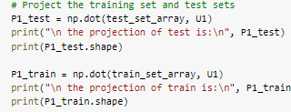
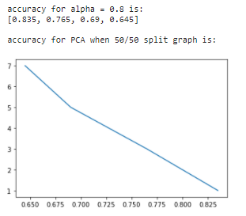
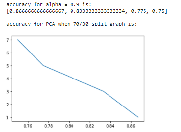

# Face Recognition Using PCA and LDA

**12 nd November 2020**

# **Problem Statement**
We intend to perform face recognition. Face recognition means that for a given image you can tell the subject id. Our database of subjects is very simple. It has 40 subjects. Below we will show the needed steps to achieve the goal of the assignment. 
# **Notebooks**
- Notebook for PCA 50/50 split and LDA 50/50 split and 70/30 split.

.ipynb)

- Notebook for PCA 70/30 split

)

# **Generate the Data Matrix**
We define a function list\_files which take directory and return list with all files in that directory. Each file is an image reshaped to 10304 and they are 400 image which mean that list is 400 x 10304

# **Split the Dataset into Training and Test sets**
In this part we split data 2 times first as 50-50 of size 200 x 10304 for both and second as 70-30 of size 280 x 10304 & 120 x 10304 **“Bonus”** . And create the label vectors.

# **Classification**
## **PCA**
- In this part we implement the PCA algorithm by defining a new function that takes the training matrix as an input with the alpha which is needed for truncation of the projection matrix.
- Returns the projection matrix used to project training and test sets.

- Get the projection matrix from the training matrix from each alpha.

- Project the training and test sets for each alpha.

## **LDA**
We define a new function called LDA which takes a training matrix and test matrix as an input and returns the new matrices after projection.

# **Classifier Tuning**
## **PCA**
`	`**For 50/50 splitting**

`	`****

This gives us that result for 50-50 split data for neighbours of [1, 3, 5, 7].

*@ alpha = 0.8*

**
`	`*@ alpha = 0.85*

*@ alpha = 0.9*

*@ alpha = 0.95*

**For 70/30 splitting**

This gives us that result for 70-30 split data for neighbours of [1, 3, 5, 7].

*@ alpha = 0.8*

*@ alpha = 0.85*

*@ alpha = 0.9*

*@ alpha = 0.95*

**Relation between alpha and classification accuracy**

When alpha increases with decreasing the neighbours the accuracy decreases.

*@ 50/50 split*

|*knn*|*PCA (alpha = 0.8)*|*PCA (alpha = 0.85)*|*PCA (alpha = 0.9)*|*PCA (alpha = 0.95)*|
| :- | :- | :- | :- | :- |
|*1*|*0.835*|*0.86*|*0.885*|*0.88*|
|*3*|*0.765*|*0.775*|*0.78*|*0.77*|
|*5*|*0.69*|*0.705*|*0.74*|*0.725*|
|*7*|*0.645*|*0.66*|*0.675*|*0.68*|

*@ 70/30 split*

|*knn*|*PCA (alpha = 0.8)*|*PCA (alpha = 0.85)*|*PCA (alpha = 0.9)*|*PCA (alpha = 0.95)*|
| :- | :- | :- | :- | :- |
|*1*|*0.8*|*0.85*|*0.8666666667*|*0.8583333333*|
|*3*|*0.79166666*|*0.8083333333*|*0.83333334*|*0.84166666667*|
|*5*|*0.73333333*|*0.7833333333*|*0.775*|*0.7583333333*|
|*7*|*0.6666666*|*0.725*|*0.75*|*0.74166666667*|

## **LDA**

This gives us that result for 50-50 split data for neighbours of [1, 3, 5, 7].

This gives us that result for 70-30 split data for neighbours of [1, 3, 5, 7].

## **Comparison of accuracy results between PCA and LDA**
*@ 50/50 split*

The result from the LDA is nearest to the result of the PCA when alpha is 0.95.

The result  from the LDA is almost better than PCA when alpha is smaller than or equal 0.85.

The result  from the PCA is almost better than LDA when alpha is greater than or equal 0.9.

|*knn*|*LDA*|*PCA (alpha = 0.8)*|*PCA (alpha = 0.85)*|*PCA (alpha = 0.9)*|*PCA (alpha = 0.95)*|
| :- | :- | :- | :- | :- | :- |
|*1*|*0.88*|*0.835*|*0.86*|*0.885*|*0.88*|
|*3*|*0.755*|*0.765*|*0.775*|*0.78*|*0.77*|
|*5*|*0.715*|*0.69*|*0.705*|*0.74*|*0.725*|
|*7*|*0.67*|*0.645*|*0.66*|*0.675*|*0.68*|

*@ 70/30 split*

The result from the LDA is nearest to the result of the PCA when alpha is 0.95.

The result  from the LDA is almost better than PCA when alpha is smaller than or equal 0.85.

The result  from the PCA is almost better than LDA when alpha is greater than or equal 0.9.

|*knn*|*LDA*|*PCA (alpha = 0.8)*|*PCA (alpha = 0.85)*|*PCA (alpha = 0.9)*|*PCA (alpha = 0.95)*|
| :- | :- | :- | :- | :- | :- |
|*1*|*0.841666667*|*0.8*|*0.85*|*0.8666666667*|*0.8583333333*|
|*3*|*0.81666667*|*0.79166666*|*0.8083333333*|*0.83333334*|*0.84166666667*|
|*5*|*0.75*|*0.73333333*|*0.7833333333*|*0.775*|*0.7583333333*|
|*7*|*0.741666667*|*0.6666666*|*0.725*|*0.75*|*0.74166666667*|
